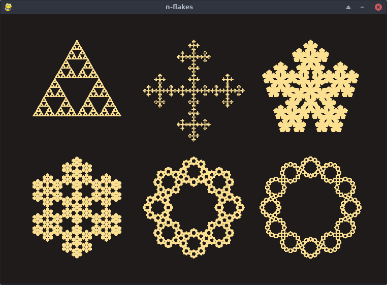
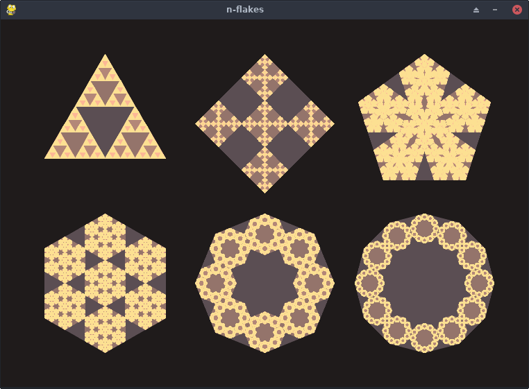
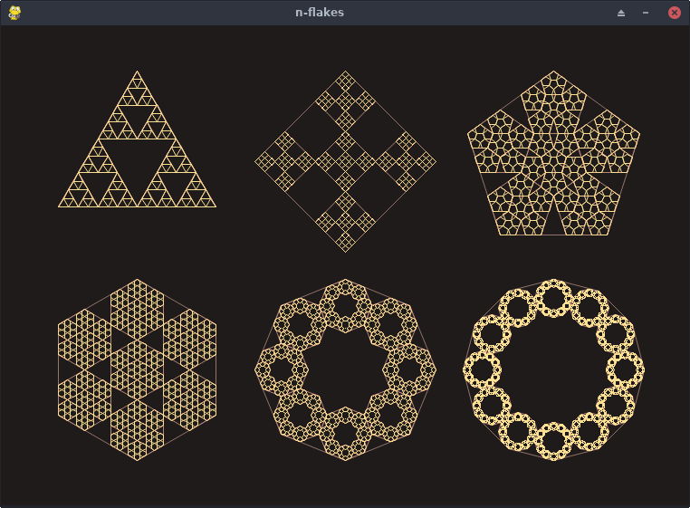

# N-flakes

- [N-flake](https://en.wikipedia.org/wiki/N-flake) fractals generator
- Uses PyGame library to draw polygons
- Calculates te polygons attributes in a recursive manner

# TODO:
- Better visualization control
