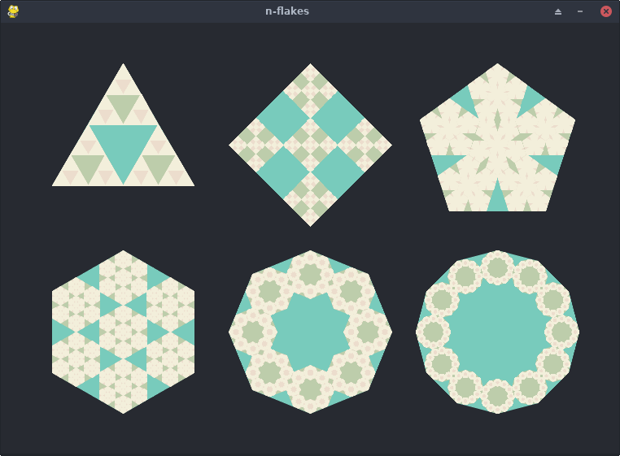
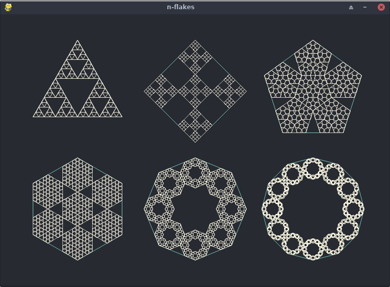

# N-flake generator

- Generates [N-flake](https://en.wikipedia.org/wiki/N-flake) fractals such as a Sierpinski triangle, a Vicsek fractal, a pentaflake, an hexaflake and others n-flakes;
- Calculates polygons' attributes in a recursive manner;

# How to run the genrator
- It only has PyGame module as a dependency
- Download the repo, install [Python 3](https://wiki.python.org/moin/BeginnersGuide/Download), install [PyGame](https://www.pygame.org/wiki/GettingStarted#Pygame%20Installation), run *n-flake-generator.py*

- Linux instructions if you already have git, python and pip installed:

	$ git clone https://github.com/stefandevai/n-flakes
	$ cd n-flakes
	$ pip install pygame
	$ python n-flake-generator

# TODO:
- Better visualization control

